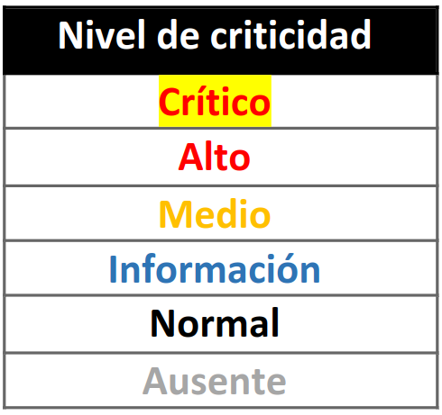

<p align="center">
    <a href="https://github.com/quimera-project/quimera/commits/main">
    
    </a>
    <a href="https://github.com/quimera-project/quimera/network/members">
        
    </a>
    <a href="https://github.com/quimera-project/quimera/stargazers">
        
    </a>
    <a href="https://github.com/quimera-project/quimera/issues">
        
    </a>
    <a href="https://github.com/quimera-project/quimera/blob/main/LICENSE.md">
        
    </a>
</p>

<p align="center">
  <a href="https://github.com/quimera-project/quimera">
    
  </a>

  <h1 align="center">Quimera Core</h1>

  <p align="center">
    Quimera es una herramienta implementada en Go para enumerar sistemas Linux y descubrir vulnerabilidades que permitan escalar privilegios. 
  </p>
</p>

## Prerrequisitos
> Se necesita tener instalada una versión de Go igual o mayor a la 1.18.

## Instalación
```go
go install github.com/quimera-project/quimera@latest
```

## Uso
```text
Usage: quimera <command>

The new era of privilege escalation

Flags:
  -h, --help         Show context-sensitive help.
  -L, --lang="en"    Select language

Laboratory:
  mutate    Create a mutant

Quimera:
  enum         Enum the system for Privilege Escalation
  benchmark    Benchmark checks test
  doc          Read the manual from a specific Privilege Escalation check
  show         Show a specific Privilege Escalation check
  run          Run a specific Privilege Escalation check

Run "quimera <command> --help" for more information on a command.
```

## Criticidad de la información
La información de los *checks* puede ser representada según distintos niveles de criticidad:



> La representación es equivalente en todos los temas.


## Contribuir
Las contribuciones al proyecto vienen explicadas en el archivo [CONTRIBUIR](.github/CONTRIBUTING.md).

## Licencia
Este proyecto está autorizado bajo la licencia GNU GPLv3.

Ver [LICENCIA](LICENSE.md) para más información.